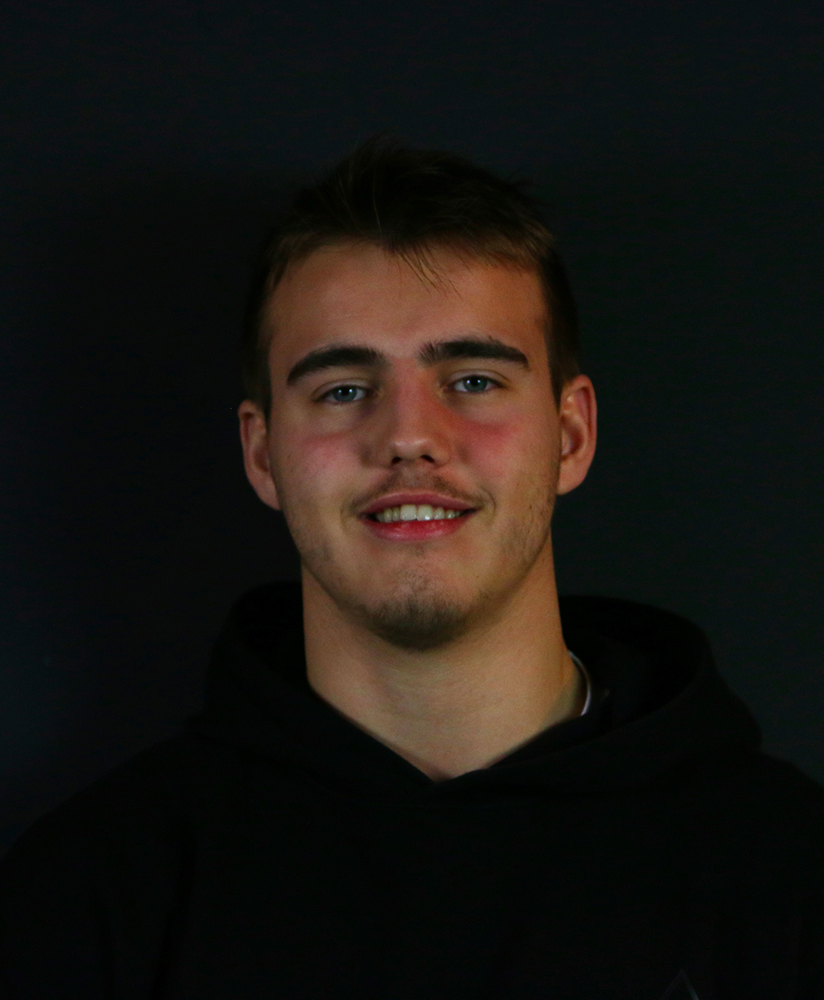

# VALENTIN DEBELS
### 21 ans

## A PROPOS
Je m’apelle Valentin, j’ai 19 ans et je suis étudiant en DUT MMI, une formation en design web et multimédia à l’université de Rouen.

## CONTACT

__Adresse:__
4 rue des Hortensias, 76710 Eslettes

__Téléphone:__
(+33)6 68 15 40 64 

__Email:__
valentin.debels@orange.fr

__Website:__
[valentindebels.fr](https://www.valentindebels.fr)

## SCOLARITE
* License Pro métiers du numérique (Infographie, Audiovisuel, CommunicationDigitale, DévelopementWeb) Université de Rouen, Elbeuf(76) France
* DUT Multimédia et Métiers de l’Internet (Infographie, Audiovisuel, CommunicationDigitale, DévelopementWeb) Université de Rouen, Elbeuf(76) France
* Bacalauréat Scientifique, Mention assez bien Lycée Rey, Bois-Guilaume(76) France

## EXPERIENCES PROFESSIONNELLES
* Stagiaire-Radio Sensation Participation au fonctionement d’une web-radio/TV lors de l’armada 2019 (Reportages sur leterain, Montage vidéo, émissions en plateau)
* Stagiaire-Trois Quart COM Réalisation de divers productions pour une agence de publicité/communication (Infographie)

## COMPETENCES
### Logiciels 
__Infographie:__
- Photoshop
- illustrator
- Indesign 

__Vidéo:__
- Première Pro
- AfterEffect
- SonyVegas 

__3D:__
- Sketchup
- Blender

### Techniques

__Infographie:__ 
- Réalisation de supports de communication visuelle

__Vidéo:__ 
- Captation images/sons
- Montage

__Programmation orienté WEB:__
- HTML
- CSS
- Bootstrap
- JavaScript
- PHP
- Wordpress
- Bases de donées (notions)
- JQuery

### Langues 
- Français
- Anglais(B1)
- Allemand(A1)
- Espagnol(A2)

## INFORMATIONS COMPLEMENTAIRES
__Activités sportives:__  
- Judo (Ceinture noire 1DAN)
- Handball (NiveauR2)

__Passions:__ 
- Sport
- Desin
- Création
- Musique

__Autre:__
- PermisB
- Véhiculé
